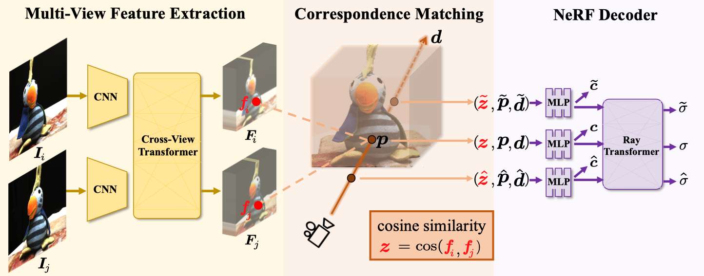

<div>

 
 
</div>

<br><br>

# MatchNeRF


<p align="center">
  <h1 align="center">Explicit Correspondence Matching for <br> Generalizable Neural Radiance Fields</h1>
  <p align="center">
    <a href="https://donydchen.github.io/">Yuedong Chen</a>
    &nbsp;·&nbsp;
    <a href="https://haofeixu.github.io/">Haofei Xu</a>
    &nbsp;·&nbsp;
    <a href="https://wuqianyi.top/">Qianyi Wu</a>
    &nbsp;·&nbsp;
    <a href="https://physicalvision.github.io/people/~chuanxia">Chuanxia Zheng</a> <br>
    <a href="https://personal.ntu.edu.sg/astjcham/">Tat-Jen Cham</a>
    &nbsp;·&nbsp;
    <a href="https://jianfei-cai.github.io/">Jianfei Cai</a>
  </p>
  <h3 align="center">TPAMI 2025</h3>
  <h3 align="center"><a href="http://arxiv.org/abs/2304.12294">Paper</a> | <a href="https://donydchen.github.io/matchnerf/">Project Page</a> | <a href="https://github.com/donydchen/matchnerf">Code</a> | <a href="https://huggingface.co/donydchen/matchnerf">Model & Data 🤗</a> </h3>
</p>




----


### Table of Contents

* [Setup Environment](#setup-environment)
* [Download Datasets](#download-datasets)
  * [DTU (for both training and testing)](#dtu-for-both-training-and-testing)
  * [Blender (for testing only)](#blender-for-testing-only)
  * [Real Forward Facing (for testing only)](#real-forward-facing-for-testing-only)
  * [Tanks and Temples (for testing only)](#tanks-and-temples-for-testing-only)
* [Testing](#testing)
* [Training](#training)
* [Rendering Video](#rendering-video)
* [Use Your Own Data](#use-your-own-data)
* [Miscellaneous](#miscellaneous)


## Setup Environment

This project is developed and tested on a **CUDA11** device. For other CUDA version, manually update the `requirements.txt` file to match the settings before preceding.

```bash
git clone --recursive https://github.com/donydchen/matchnerf.git
cd matchnerf
conda create --name matchnerf python=3.8
conda activate matchnerf
pip install -r requirements.txt
```

Troubleshooting:

<details>
  <summary><b>Run on CUDA-12</b></summary>
This project has also been tested in an environment using CUDA 12. The recommended PyTorch installation is:

```bash
pip install torch==2.1.0 torchvision==0.16.0 --index-url https://download.pytorch.org/whl/cu121
```
</details>

<details>
  <summary><b>Failed when rendering video</b></summary>
To render video outputs, `ffmpeg` must be installed on your system. You can verify the installation by running `ffmpeg -version`. If `ffmpeg` is not found, you can install it using:

```bash
conda install ffmpeg
```

</details>

<details>
  <summary><b>Failed when calculating SSIM scores</b></summary>
Due to compatibility issues, this project depends on an older version of `scikit-image`. Please install the appropriate version using:

```bash
pip install scikit_image==0.19.2
```
</details>


## Download Datasets

### DTU (for both training and testing)

* Download the preprocessed DTU training data [dtu_training.rar](https://drive.google.com/file/d/1eDjh-_bxKKnEuz5h-HXS7EDJn59clx6V/view) and [Depth_raw.zip](https://virutalbuy-public.oss-cn-hangzhou.aliyuncs.com/share/cascade-stereo/CasMVSNet/dtu_data/dtu_train_hr/Depths_raw.zip) from original [MVSNet repo](https://github.com/YoYo000/MVSNet).

* Extract 'Cameras/' and 'Rectified/' from the above downloaded 'dtu_training.rar', and extract 'Depths' from the 'Depth_raw.zip'. Link all three folders to `data/DTU`, which should then have the following structure

```bash
data/DTU/
    |__ Cameras/
    |__ Depths/
    |__ Rectified/
```

### Blender (for testing only)

* Download [nerf_synthetic.zip](https://huggingface.co/donydchen/matchnerf/resolve/main/nerf_synthetic.zip) and extract to `data/nerf_synthetic`.

### Real Forward Facing (for testing only)

* Download [nerf_llff_data.zip](https://huggingface.co/donydchen/matchnerf/resolve/main/nerf_llff_data.zip) and extract to `data/nerf_llff_data`.

### Tanks and Temples (for testing only)

* Download [tnt_data.zip](https://huggingface.co/donydchen/matchnerf/resolve/main/tnt_data.zip) and extract to `data/tnt_data`.


## Testing

### MVSNeRF Setting (3 Nearest Views)

Download the pretrained model [matchnerf_3v.pth](https://huggingface.co/donydchen/matchnerf/resolve/main/matchnerf_3v.pth) and save to `configs/pretrained_models/matchnerf_3v.pth`, then run

```bash
python test.py --yaml=test --name=matchnerf_3v
```

If encounters CUDA out-of-memory, please reduce the ray sampling number, e.g., append `--nerf.rand_rays_test==4096` to the command.

Performance should be exactly the same as below,

| Dataset    | PSNR  | SSIM  | LPIPS |
| ------- | ------| ----- | ------|
| DTU                  | 26.91 | 0.934 | 0.159 |
| Real Forward Facing  | 22.43 | 0.805 | 0.244 |
| Blender | 23.20 | 0.897 | 0.164 |
| Tanks and Temples | 21.94 | 0.840 |  0.258

## Training

Download the GMFlow pretrained weight ([gmflow_sintel-0c07dcb3.pth](https://huggingface.co/donydchen/matchnerf/resolve/main/gmflow_sintel-0c07dcb3.pth)) from  the original [GMFlow repo](https://github.com/haofeixu/gmflow), and save it to `configs/pretrained_models/gmflow_sintel-0c07dcb3.pth`, then run

```bash
python train.py --yaml=train
```

## Rendering Video

```bash
python test.py --yaml=test_video --name=matchnerf_3v_video
```

Results (without any per-scene fine-tuning) should be similar as below,

<details>
  <summary>Visual Results</summary>

<br>
*DTU: scan38_view24*

<br>
*Blender: materials_view36*

<br>
*Real Forward Facing: leaves_view13*

</details>


## Use Your Own Data

* Download the model ([matchnerf_3v_ibr.pth](https://huggingface.co/donydchen/matchnerf/resolve/main/matchnerf_3v_ibr.pth)) pretrained with IBRNet data (follow 'GPNR Setting 1'), and save it to `configs/pretrained_models/matchnerf_3v_ibr.pth`.
* Following the instructions detailed in the [LLFF repo](https://github.com/Fyusion/LLFF#1-recover-camera-poses), use [img2poses.py](https://github.com/Fyusion/LLFF/blob/master/imgs2poses.py) to recover camera poses.
* Update the colmap data loader at `datasets/colmap.py` accordingly.

We provide the following 3 input views demo for your reference.

```bash
# lower resolution but fast
python test.py --yaml=demo_own
# full version
python test.py --yaml=test_video_own
```

The generated video will look like,

<br>
*Demo: own data, printer*


## Miscellaneous

### Citation

If you use this project for your research, please cite our paper.

```bibtex
@article{chen2025explicit,
  title={Explicit correspondence matching for generalizable neural radiance fields},
  author={Chen, Yuedong and Xu, Haofei and Wu, Qianyi and Zheng, Chuanxia and Cham, Tat-Jen and Cai, Jianfei},
  journal={IEEE Transactions on Pattern Analysis and Machine Intelligence},
  year={2025},
  publisher={IEEE}
}
```

### Acknowledgments

This implementation borrowed many code snippets from [GMFlow](https://github.com/haofeixu/gmflow), [MVSNeRF](https://github.com/apchenstu/mvsnerf), [BARF](https://github.com/chenhsuanlin/bundle-adjusting-NeRF), [GIRAFFE](https://github.com/autonomousvision/giraffe) and [MVSGaussian](https://github.com/TQTQliu/MVSGaussian). Many thanks for all the above mentioned projects.
